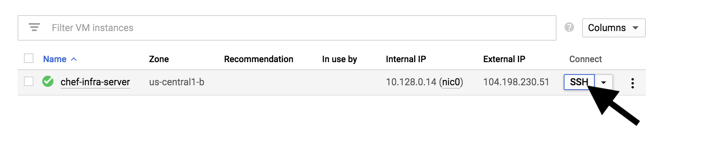
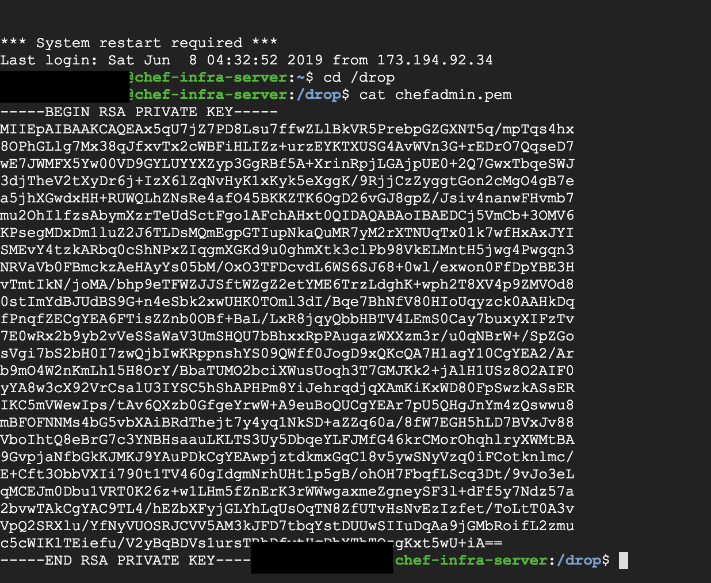

### Configuring your workstation to connect to the Chef Server

1. Before we start connecting our workstation to the Chef Server, the Chef server needs to be up and running. To achieve this follow the documentation [here](../chef-server-configuration/README.MD)

2. Once you are done with step 1 you can change directory to the cookbooks directory and export the following environment variable on your terminal

```
cd cookbooks
export HOSTNAME="The domain name that is pointing to your chef server"
```

3. Fetch the contents of the chefadmin.pem file on your server instance.

This step requires you to ssh into your running server. You can find more instructions [here](https://cloud.google.com/compute/docs/instances/connecting-to-instance).

Move into the /drop directory, and copy the contents of the chefadmin.pem

Copy the contents you find here to the chefadmin.pem file located under the .chef folder.
The contents fo the file change every time a new chef server instance is created.

4. Once this is done you can run the commands below to create a connection:

```
knife ssl fetch
```
The fetch command will fetch the certificate that was automatically generated to connect to your chef server using knife.

```
knife ssl check
```
The check command will confirm if the certificate that has been fetched is valid.

You should not get any errors with the commands above but success or warning messages.
If the commands work, your workstation is now connected to your chef infra server.

### Uploading a cookbook to the Chef Server

Once you have performed the [Configuring your workstation to connect to the Chef Server](#configuring-your-workstation-to-connect-to-the-Chef-Server) step you can upload a cookbook to your chef server.

1. Ensure that you are on the cookbooks directory before running the command below.

```
knife cookbook upload postgres_database
knife cookbook upload postgres_database_standby
```
You should get the success message: *Created postgres_database*

### Testing a cookbook

To test a cookbook, you need to change directory into the cookbook and run the test command as shown below:

```
cd postgres_database
chef exec rspec
```

### Provide the name of the storage bucket

On the [postgresql.conf](postgres_database/files/postgresql.conf) file you need to edit the code below.

```
archive_command = 'export CLOUDSDK_PYTHON=/usr/bin/python && gsutil cp %p gs://{BUCKET_NAME}/prirmay-database-archive/%f'	
```

The `{BUCKET_NAME}` should be a private bucket on GCS which stores the archives for the master database.

### Bootstrap a node with the postgres_database cookbook.

To boostrap a node, you need to run the command below. Note that the `ssh-user` is `ubuntu`, since our node uses the ubuntu user as the user responsible for performing an SSH connection. 

```
knife bootstrap <ip address of the node> --ssh-user ubuntu --sudo --identity-file ../chef-server-configuration/chef_node_ssh_key --node-name node1-ubuntu --run-list 'recipe[postgres_database]'
```
By running the above, all the definitions of your cookbook should be performed on the node.

In case you get an issue where you try to bootstrap and this command refuses, this could be because the host had been added to the known_hosts file previously. You may need to edit the known_hosts file and delete the line that contains your node's IP address and key.
